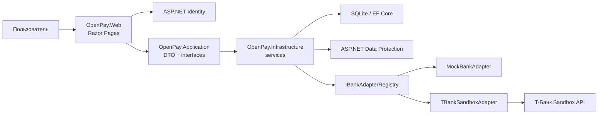
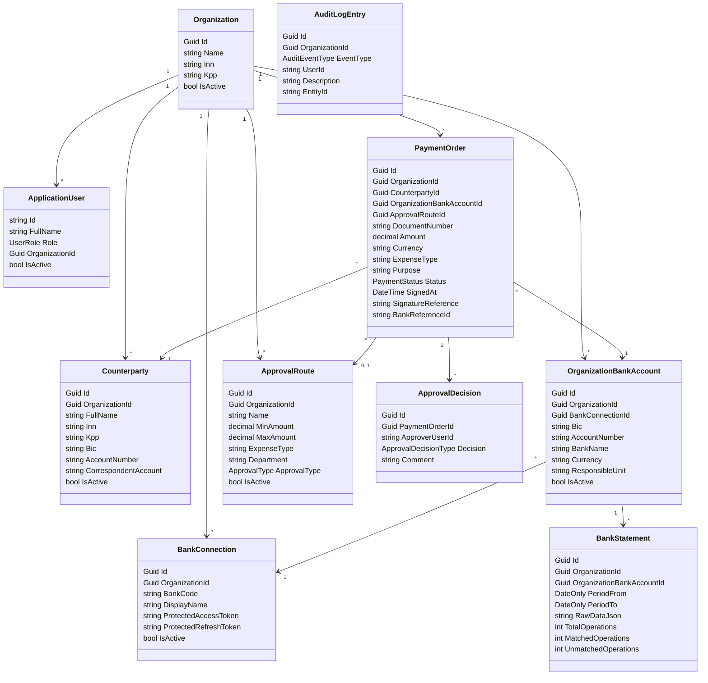
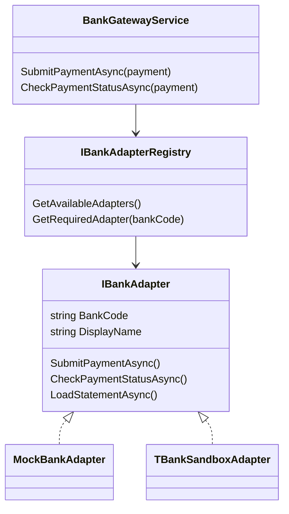
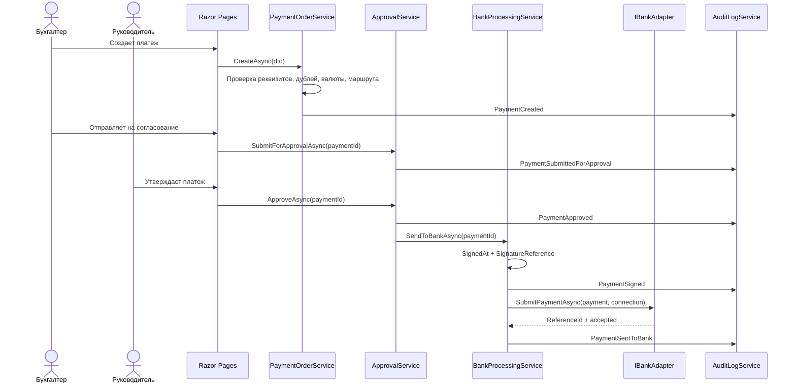
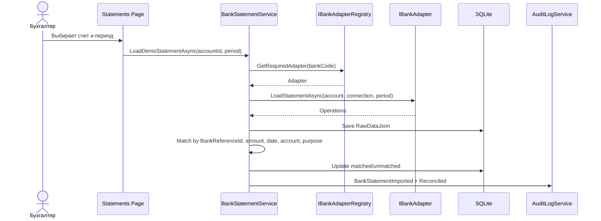

# Архитектура OpenPay

OpenPay - прототип системы управления платежными поручениями организации. Архитектура построена слоями: доменная модель, прикладные контракты, инфраструктурные сервисы и Razor Pages UI.

## Цели архитектуры

- Отделить бизнес-логику от UI.
- Оставить расширяемую точку интеграции с банками через адаптеры.
- Хранить токены банковских подключений в защищенном виде.
- Поддержать маршруты согласования, аудит, отчеты, выписки и сверку.
- Сохранить простую демонстрационную эксплуатацию без реальных банковских сертификатов и криптоподписи.

## Слои решения

| Проект | Назначение |
|---|---|
| `OpenPay.Domain` | Сущности и enum: организации, пользователи, счета, контрагенты, платежи, маршруты, выписки, аудит |
| `OpenPay.Application` | DTO, интерфейсы сервисов, валидаторы реквизитов |
| `OpenPay.Infrastructure` | EF Core, SQLite, Identity, реализации сервисов, банковские адаптеры, Data Protection |
| `OpenPay.Web` | Razor Pages UI, авторизация, формы, навигация, CSS/JS |
| `OpenPay.Tests` | Unit/service/web smoke тесты на xUnit |

## Компонентная схема

## Основные сущности

## Ключевые сервисы

| Сервис | Ответственность |
|---|---|
| `PaymentOrderService` | Создание, редактирование, поиск дублей, выбор маршрута, импорт платежей |
| `ApprovalService` | Отправка на согласование, утверждение, отклонение, возврат на доработку |
| `BankProcessingService` | Демо-подпись, отправка в банк, проверка банковского статуса |
| `BankGatewayService` | Выбор банковского адаптера по подключению счета |
| `BankConnectionService` | CRUD банковских подключений и защищенное хранение токенов |
| `BankStatementService` | Загрузка выписок, хранение raw JSON, сверка операций |
| `ApprovalRouteService` | CRUD маршрутов и условия согласования |
| `ReportService` | Агрегация отчетов по статусам и контрагентам |
| `ReportExportService` | CSV/XLSX экспорт |
| `AuditLogService` | Запись действий пользователя |
| `CurrentOrganizationService` | Изоляция данных по организации текущего пользователя |

## Банковские адаптеры

Новые банки подключаются добавлением новых классов-адаптеров, реализующих `IBankAdapter`, без изменения основной бизнес-логики платежей.

## Последовательность платежа

## Последовательность выписки и сверки

## Безопасность

- Авторизация построена на ASP.NET Identity и ролях `Accountant`, `Manager`, `Administrator`, `PlatformAdmin`.
- Данные пользователей организации фильтруются через `CurrentOrganizationService`.
- Банковские токены сохраняются в `ProtectedAccessToken` и `ProtectedRefreshToken`.
- Data Protection настроен на локальное хранение ключей web-проекта, чтобы прототип работал без доступа к пользовательскому `AppData`.
- Для ВКР используется имитация подписи: `SignedAt` и `SignatureReference`, без реальной криптографии.

## Ограничения прототипа

- Реальная криптоподпись не реализована.
- Реальные банковские сертификаты и mTLS не настраиваются.
- Sequential/parallel согласование хранится как тип маршрута, но фактически решение принимает любой руководитель организации.
- T-Банк Sandbox зависит от TLS/сертификатной конфигурации локальной Windows-среды.
- В части старых Razor/CS файлов еще могут встречаться mojibake-строки. Перед финальной демонстрацией нужно пройтись по UI и исправить нечитаемый текст.
