# Диаграммы последовательностей OpenPay

Документ содержит диаграммы последовательностей для ключевых бизнес-сценариев OpenPay. Участники диаграмм указаны на уровне модулей проекта: Razor Pages UI, сервисы, EF Core/SQLite, ASP.NET Identity, банковский шлюз, адаптеры и аудит.

## 1. Вход пользователя и определение организации

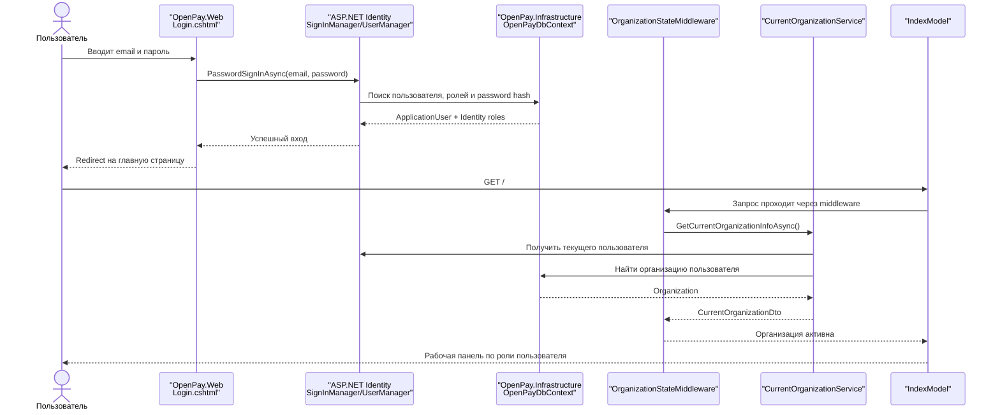

## 2. Создание платежа бухгалтером

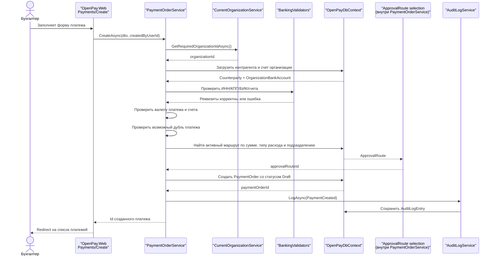

## 3. Отправка платежа на согласование

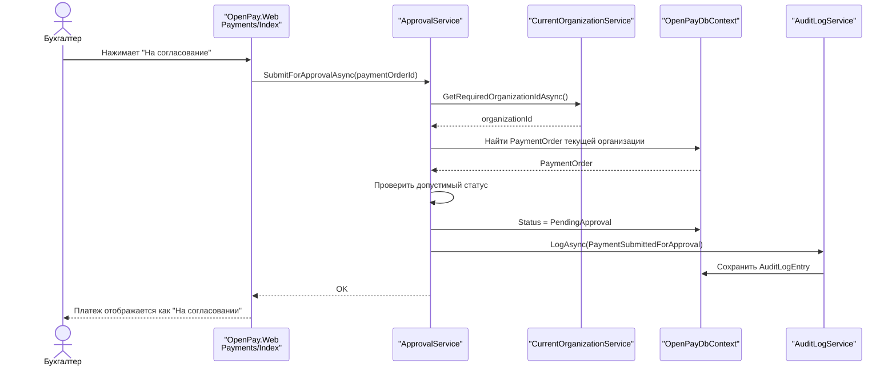

## 4. Рассмотрение платежа руководителем

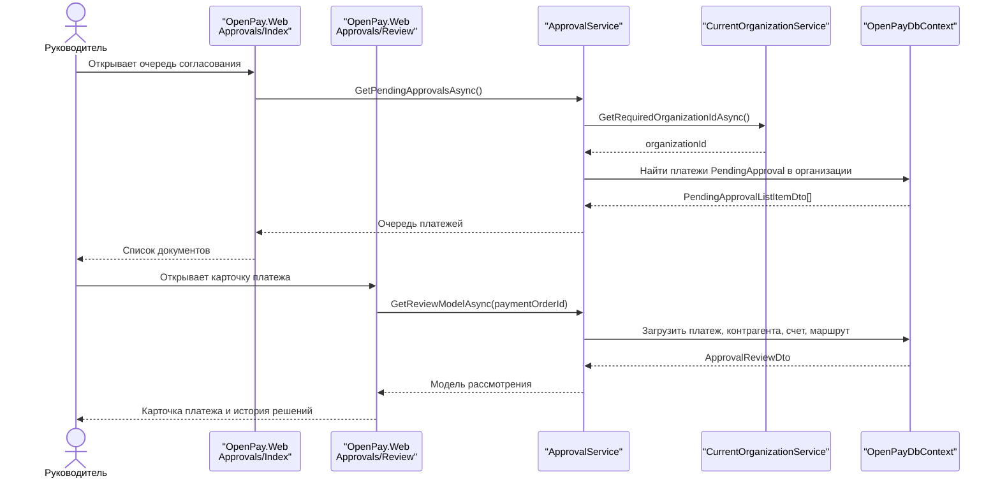

## 5. Утверждение платежа и автоматическая отправка в банк

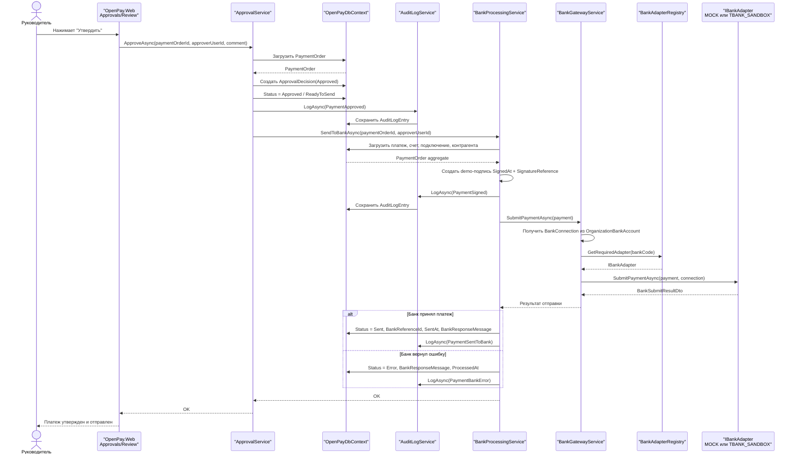

## 6. Отклонение платежа или возврат на доработку

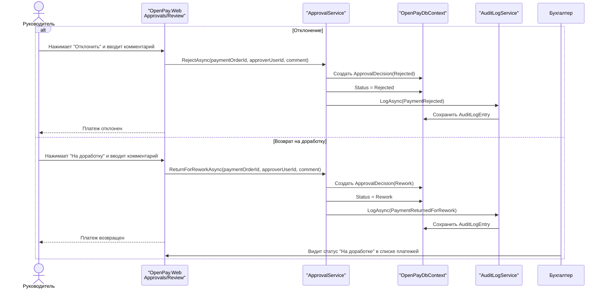

## 7. Ручная fallback-отправка платежа в банк

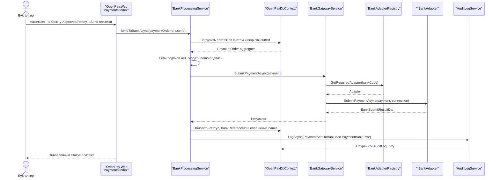

## 8. Фоновая проверка банковских статусов

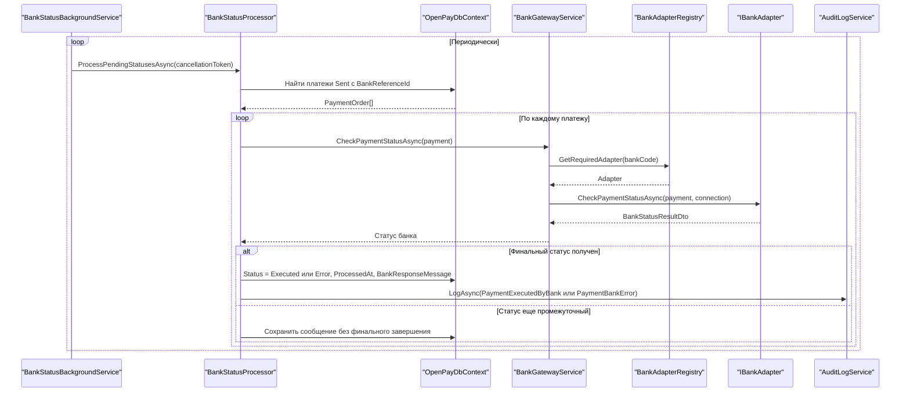

## 9. Создание банковского подключения

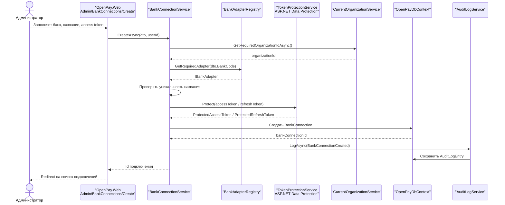

## 10. Загрузка выписки и сверка

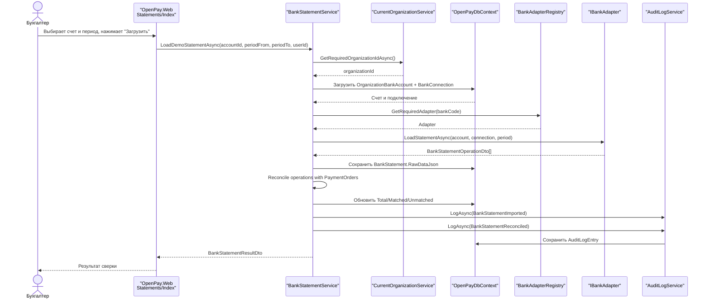

## 11. CSV-импорт контрагентов

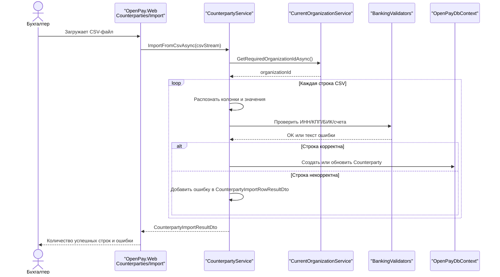

## 12. CSV-импорт платежей

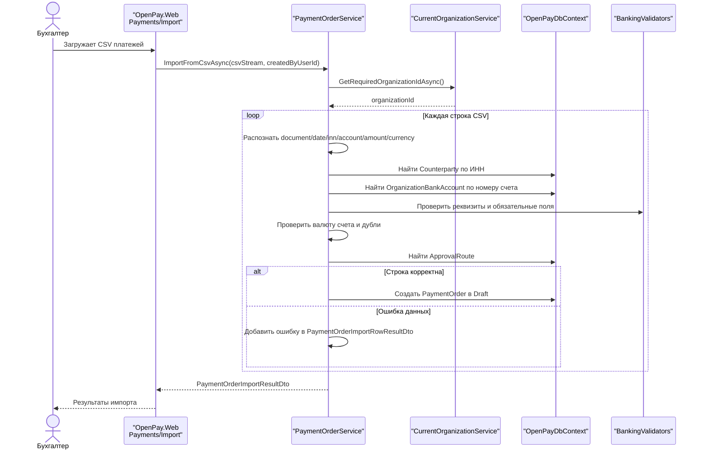

## 13. Формирование отчета и экспорт

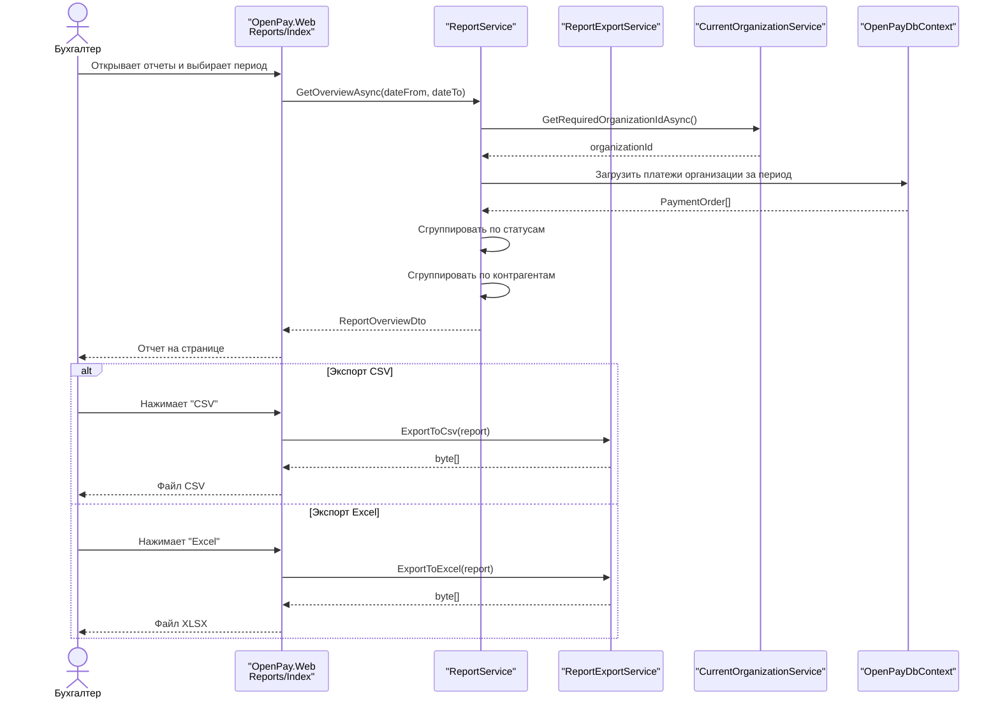

## 14. Управление пользователями и синхронизация ролей

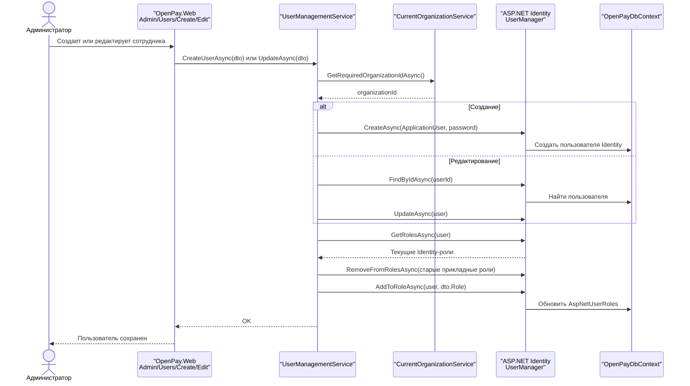

## 15. Выбор маршрута согласования при создании платежа

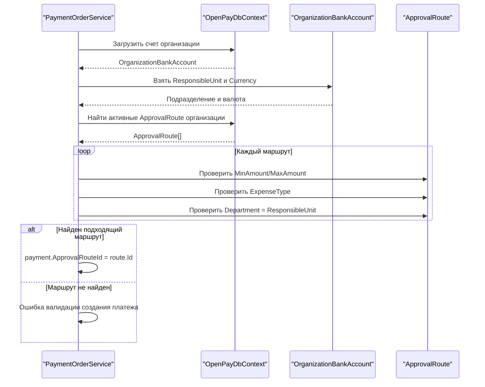

## Итоговая связка модулей

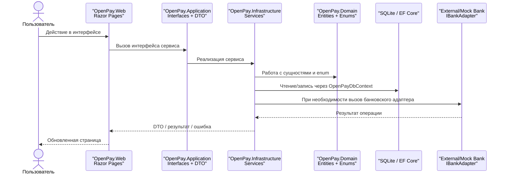
